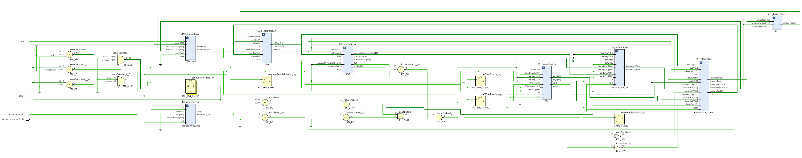
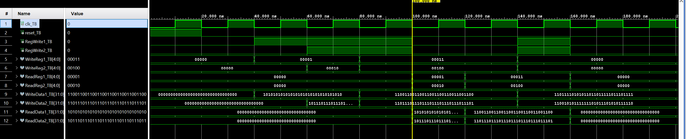
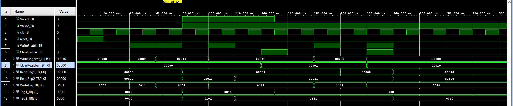
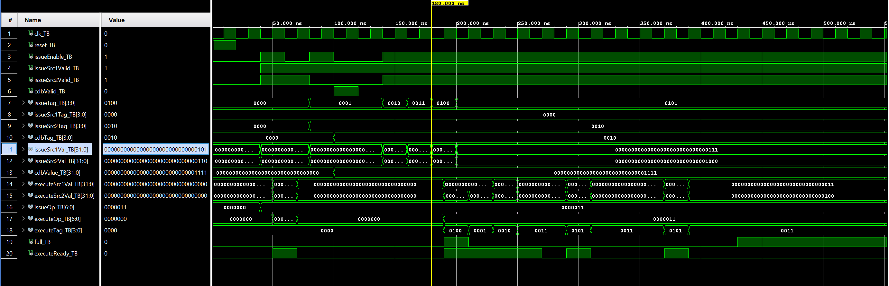
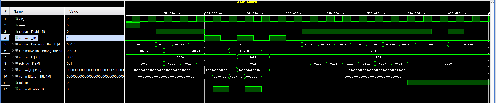
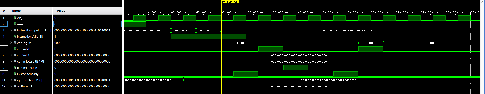

# RISC-V Out-of-Order Processor with Tomasulo's Algorithm
---
This repository contains the implementation of a **cycle-accurate RISC-V out-of-order processor** using **Tomasulo's Algorithm** in VHDL for **ECE 622: Computer Systems Architecture** (Spring 2026).

**Author:** Antonio Anzora Jr  
**Professor:** Dr. Mirzaei Shahnam

## Overview
---
This project demonstrates dynamic instruction scheduling, register renaming, and in-order commitment through a complete RTL implementation in VHDL. The processor executes a subset of the RISC-V RV32I instruction set and is verified through detailed behavioral simulations in Vivado 2023.2.

## Project Structure

### Core Components (18 VHDL files)

| Component | Purpose |
|-----------|---------|
| **Register_File_32** | 32 registers with dual write/read ports |
| **RAT** | Register Alias Table for register renaming |
| **Instruction_Queue** | 8-entry FIFO for fetched instructions |
| **Reservation_Status** | Dynamic instruction scheduling (4 entries) |
| **ALU** | Arithmetic/Logic Unit (ADD, SUB, AND, OR, XOR, SLT) |
| **MEM_Unit** | Load/Store functional unit with simulated memory |
| **CDB** | Common Data Bus for result broadcasting |
| **ROB** | Reorder Buffer for in-order commit (8 entries) |
| **TOP** | Top-level integration with control logic |

Each component includes:
- Entity + Architecture (`.vhd`)
- Comprehensive testbench (`_TB.vhd`)

### Warmup Components (6 VHDL files)
- `D_FF.vhd` / `D_FF_tb.vhd` — Basic flip-flop
- `FIFO.vhd` / `FIFO_tb.vhd` — Circular buffer
- `Register_File.vhd` / `Register_File_tb.vhd` — 8-register warmup

---

## Key Features

- **Out-of-Order Execution:** Instructions execute based on operand availability
- **Register Renaming:** RAT eliminates false data dependencies (WAR, WAW hazards)
- **Dynamic Scheduling:** Reservation Stations track operand readiness
- **In-Order Commit:** ROB ensures architectural consistency
- **CDB Snooping:** All components listen for broadcast results

---

## Architecture

---

##  Simulation Results

All components verified through behavioral simulation in **Vivado 2023.2**. Five key simulations demonstrate processor functionality:

### Figure 1: RTL Block Diagram (Vivado Schematic)

*The complete processor RTL schematic showing all eight components and their interconnections.*

---

### Figure 2: Register File 32 — Dual-Port Write and Read Operations

**What this demonstrates:**
- Simultaneous writes to registers x1 and x2 (40-80ns)
- Parallel read operations return correct values (100-120ns)
- x0 register protection (hardwired to zero)

**Why it matters:** Enables dual-operand instruction issuance with independent reads/writes.

---

### Figure 3: RAT — Register Renaming and Tag Tracking

**What this demonstrates:**
- Register x1 mapped to ROB entry 3 (tag 0011) at 40-60ns
- Register x2 mapped to ROB entry 5 (tag 0101) at 60-80ns
- Read operations return correct tags (80-100ns)

**Why it matters:** Register renaming eliminates false data dependencies by mapping architectural registers to in-flight ROB entries.

---

### Figure 4: Reservation Stations — Dynamic Scheduling and CDB Snooping

**What this demonstrates:**
- Instruction with both operands ready executes immediately (40-60ns)
- Instruction with missing operand waits (60-80ns)
- CDB broadcasts complete the operand (80ns), instruction becomes ready (100ns)
- Multiple instructions fill RS to capacity

**Why it matters:** RS enables out-of-order execution by scheduling instructions based on operand readiness, not program order.

---

### Figure 5: ROB — In-Order Commitment and Full Detection

**What this demonstrates:**
- Three instructions enqueue to ROB entries (40-80ns)
- CDB broadcasts mark each instruction done (80-140ns)
- Instructions commit in program order (sequential commitEnable pulses)
- ROB fills to capacity (8 entries), rejects 9th instruction

**Why it matters:** ROB ensures architectural correctness by committing instructions in program order despite out-of-order execution.

---

### Figure 6: TOP-Level — Full Out-of-Order Pipeline Execution

**What this demonstrates:**
- Three instructions (ADDI, LW, ADD) issue sequentially
- ALU executes when operands ready (rsExecuteReady pulses)
- CDB broadcasts results at different times (out-of-order execution)
- ROB commits instructions sequentially (in-order commitment)

**Key observation:** Notice that cdbValid pulses occur at different times (different instructions executing at different times), but commitEnable pulses occur sequentially. **This proves Tomasulo's Algorithm works: out-of-order execution with in-order commitment.**

---

## Tools & Environment

- **Language:** VHDL
- **Simulator:** Vivado 2023.2 (Behavioral Simulation)
- **Target:** Simulation only (no synthesis/bitstream)
- **ISA:** RISC-V RV32I (subset)

---

## Testing

Each component is independently verified with testbenches covering:
- Basic functionality
- Edge cases (full/empty conditions, wraparound)
- CDB snooping and result forwarding
- Commit semantics

Integration tested via `TOP_tb.vhd` with multi-instruction programs.

## Documentation

- **ProjectPaper_ece622sp26.docx** — IEEE-format Report paper (2-4 pages)
